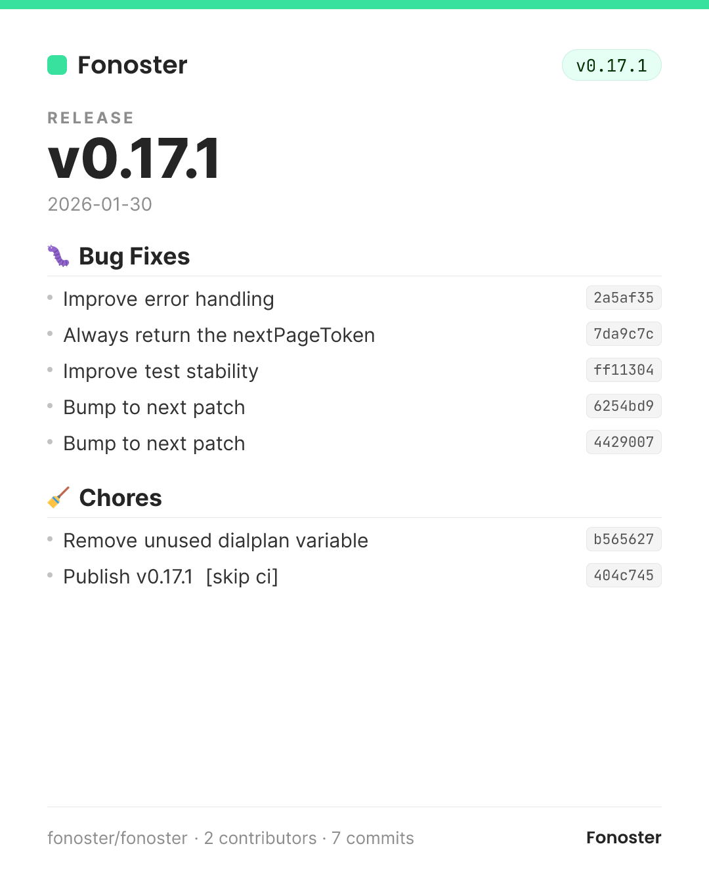
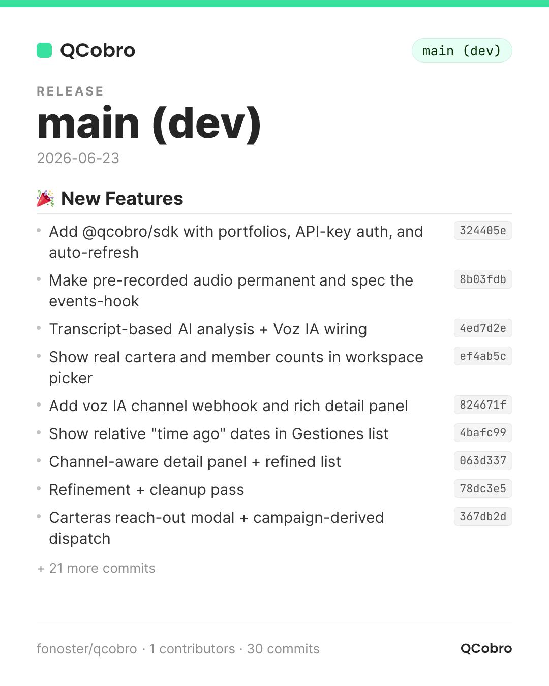
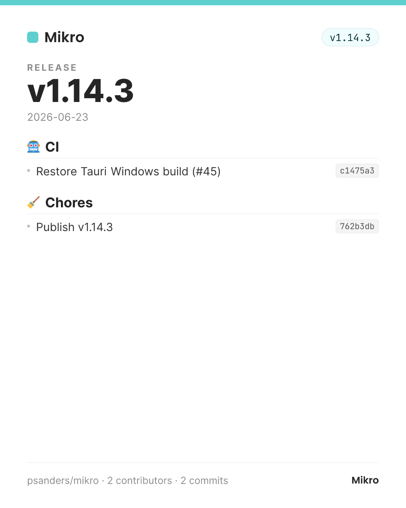
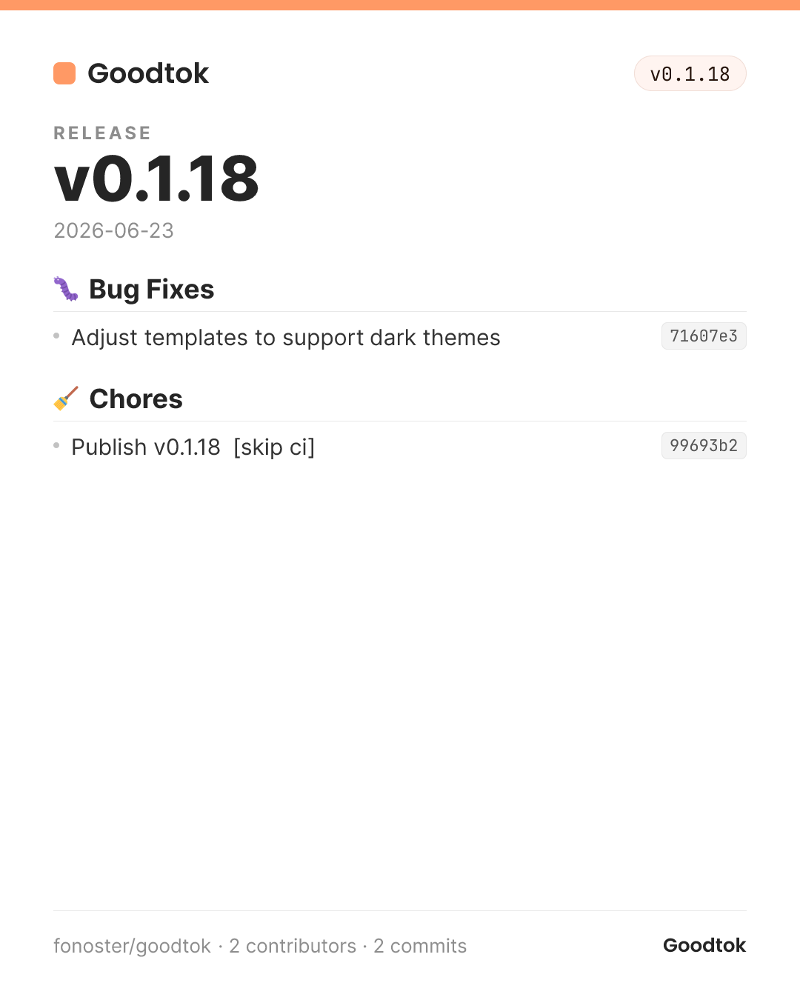
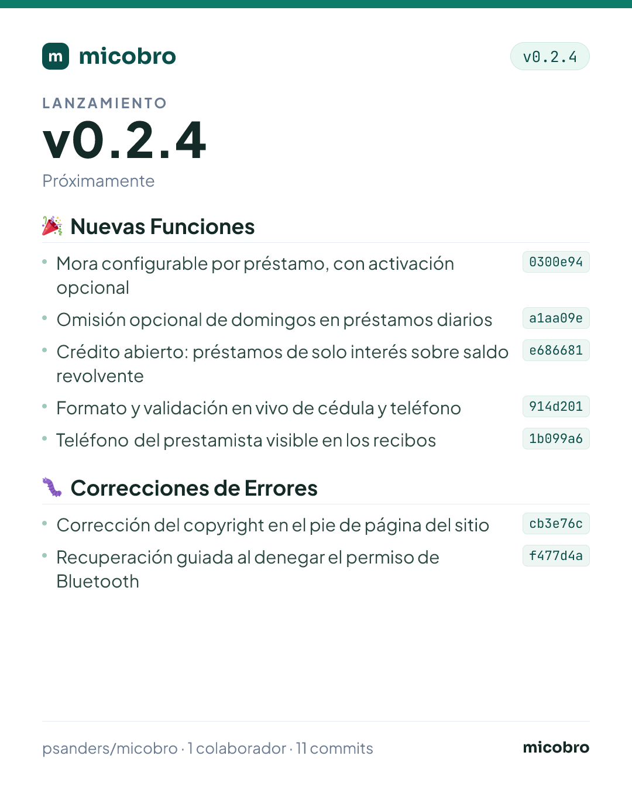

# release-card examples

Real cards generated from the latest release of each project, with its brand color.

| Project | Command | Card |
| :--- | :--- | :--- |
| **Fonoster** | `/ps:release-card --color fonoster-green --logo Fonoster` |  |
| **QCobro** | `/ps:release-card --color fonoster-green --logo QCobro --max 9` |  |
| **Mikro** | `/ps:release-card --color fonoster-blue --logo Mikro` |  |
| **Goodtok** | `/ps:release-card --color fonoster-orange --logo Goodtok` |  |
| **micobro** | `/ps:release-card --color micobro --lang es --logo micobro` |  |

> QCobro has no tagged release yet, so its card is built from recent `main`
> commits and labeled `main (dev)`; `--max 9` trims the 30-commit list with a
> "+N more commits" line.
>
> micobro uses its own from-scratch brand theme (not a Fonoster accent swap —
> see Guardrails in `SKILL.md`) and `--lang es`, which translates the card's
> chrome only; the commit messages themselves were translated by the agent
> before writing notes.json.
